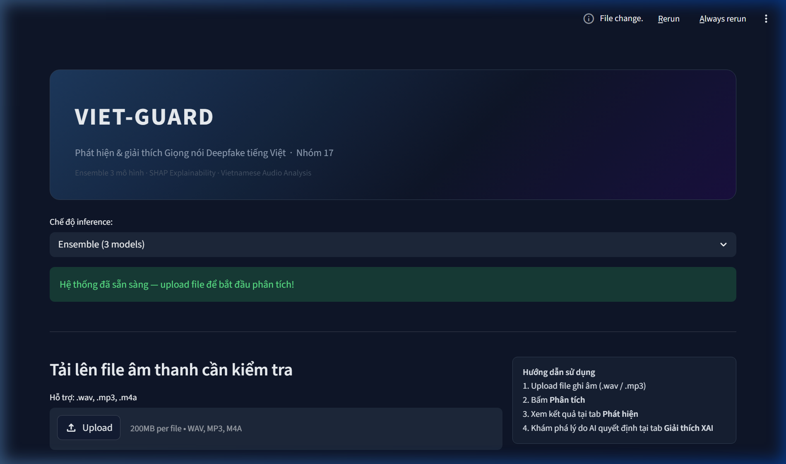

<div align="center">

# Viet-Guard
### Vietnamese Audio Deepfake Detection

*Phát hiện giọng nói deepfake tiếng Việt sử dụng Ensemble đặc trưng âm học đa nhóm và học sâu AASIST*


*Seminar — Nhóm 17 | Viện Trí tuệ Nhân tạo | Trường Đại học Công nghệ*

---

</div>

## Mục lục

1. [Tóm tắt](#1-tóm-tắt)
2. [Mục tiêu nghiên cứu](#2-mục-tiêu-nghiên-cứu)
3. [Dataset](#3-dataset)
4. [Kiến trúc hệ thống](#4-kiến-trúc-hệ-thống)
5. [Các mô hình](#5-các-mô-hình)
6. [XAI — Giải thích mô hình](#6-xai--giải-thích-mô-hình)
7. [Cấu trúc thư mục](#7-cấu-trúc-thư-mục)
8. [Cài đặt](#8-cài-đặt)
9. [Hướng dẫn chạy](#9-hướng-dẫn-chạy)
10. [Web App](#10-web-app)
11. [Đánh giá độ bền vững dưới nhiễu](#11-đánh-giá-độ-bền-vững-dưới-nhiễu-robustness-evaluation)
12. [Giới hạn và hướng phát triển](#12-giới-hạn-và-hướng-phát-triển)

---

## 1. Tóm tắt

Sự bùng nổ của công nghệ Text-to-Speech (TTS) và Voice Conversion (VC) đặt ra thách thức nghiêm trọng trong việc xác thực giọng nói số. **Viet-Guard** là hệ thống phát hiện giọng nói deepfake tiếng Việt được xây dựng theo hướng tiếp cận đa đặc trưng:

- Kết hợp 3 nhóm đặc trưng âm học: **Spectral (LFCC)**, **Temporal (MFCC-Delta)**, **Semantic (Wav2Vec2)**
- Triển khai **Weighted Soft-Voting Ensemble** (Inverse-EER weighting) để tổng hợp quyết định tối ưu
- Tích hợp **AASIST** (mô hình học sâu xử lý raw waveform) làm so sánh baseline mạnh
- Cung cấp **giải thích mô hình** (XAI) thông qua SHAP và Gradient-based Saliency

---

## 2. Mục tiêu nghiên cứu

| Mục tiêu | Mô tả |
|---|---|
| **So sánh đặc trưng** | Đánh giá hiệu quả các nhóm feature (MFCC, LFCC, Wav2Vec2, Tone-Aware) trên tiếng Việt |
| **Ensemble learning** | Khảo sát Soft Voting, Stacking, Early Fusion trên bài toán phát hiện deepfake |
| **Generalization** | Kiểm tra khả năng tổng quát hoá trên nguồn TTS chưa thấy trong training |
| **Robustness** | Đánh giá độ bền vững dưới các điều kiện nhiễu thực tế (white noise, MP3, telephone) |
| **Interpretability** | Cung cấp giải thích quyết định thông qua XAI để tăng tính tin cậy |

---

## 3. Dataset

### ViSpoofDB — Vietnamese Spoof Database

Dataset tự xây dựng gồm **14.195 mẫu** tiếng Việt, cân bằng giữa giọng thật và giọng AI:

| Nhãn | Nguồn | Số mẫu |
|---|---|---:|
| **Real** | VIVOS, VLSP (người đọc tự nhiên) | ~7.000 |
| **Fake** | FPT.AI, Viettel TTS, ElevenLabs, Coqui TTS | ~5.600 |
| **Fake (unseen)** | gTTS — hệ thống TTS chưa thấy trong train | ~1.600 |

**Phân chia tập dữ liệu:**

```
Train:        8.996 mẫu  (63%)
Test Seen:    2.599 mẫu  (18%) — nguồn AI đã xuất hiện khi train
Test Unseen:  2.600 mẫu  (18%) — nguồn AI hoàn toàn mới
```

**Tải dữ liệu:**

| Phần | Link | Dung lượng |
|---|---|---|
| ViSpoofDB raw data | [Google Drive](https://drive.google.com/drive/folders/1NZWOJi8g9nLfId1fSTkEc9Ay18P0c2LR?usp=sharing) | ~2.4 GB |
| Thu nghiem raw data | [Google Drive](https://drive.google.com/drive/folders/1Dt2kEhL8IFRJ3cIQNiuddiVPKwF5bqLC?usp=sharing) | ~274 MB |

> Data không được lưu trong git. Đặt theo cấu trúc `vispoofdb/data/raw/{real,fake}/`.

---

## 4. Kiến trúc hệ thống

```
                    Audio Input (.wav / .mp3)
                           |
              +------------+------------+
              |                         |
     Feature Extraction            Raw Waveform
              |                         |
    +---------+---------+               |
    |         |         |               |
  LFCC     MFCC-Δ   Wav2Vec2        AASIST
  (40d)   (480d)    (768d)        (Deep Learning)
    |         |         |
  SVM     XGBoost    MLP
    |         |         |
    +---------+---------+
              |
     Weighted Soft-Voting
              |
         Prediction
     (Real / Deepfake)
              |
         XAI Explanation
      (SHAP / Saliency)
```

**Pipeline 7 bước:**

```
Bước 1: Data Processing    → augmentation, chuẩn hoá, metadata
Bước 2: Feature Extraction → LFCC, MFCC-Δ, Wav2Vec2, Tone-Aware, raw
Bước 3: Model Training     → 6 mô hình cơ sở + AASIST
Bước 4: Fusion Experiments → Late Fusion, Stacking, Early Fusion
Bước 5: Visualization      → ROC, DET, Confusion Matrix
Bước 6: Noise Evaluation   → robustness dưới white noise / MP3 / telephone
Bước 7: Quantization       → nén AASIST (dynamic INT8)
```

---

## 5. Các mô hình

### Mô hình cơ sở

| Mô hình | Đặc trưng | Chiều | Ghi chú |
|---|---|---:|---|
| SVM (RBF) | LFCC | 40 | Linear Cepstral — tổng quát hoá tốt |
| SVM (RBF) | MFCC | 40 | Mel-scale cepstral |
| MLP | MFCC | 40 | 3 hidden layers, early stopping |
| XGBoost | MFCC + Δ + ΔΔ | 480 | Hyperparameter tuning + early stopping |
| MLP | Wav2Vec2 | 768 | Self-supervised pre-trained features |
| SVM | Tone-Aware | 24 | F0, Jitter, Shimmer, HNR |
| **AASIST** | Raw waveform | — | Graph Attention Network |

### Ensemble của dự án

**VietGuardEnsemble** — Weighted Soft-Voting trên 3 nhóm đặc trưng. Trọng số của mỗi mô hình tỉ lệ nghịch với EER (Equal Error Rate) trên tập Validation (Inverse-EER Weighting) — mô hình có lỗi thấp hơn sẽ có trọng số bầu chọn cao hơn:

- **Group 1: SVM + LFCC** (Spectral — Anti-Spoofing features)
  - Validation EER: ~0.35 $\rightarrow$ Trọng số $w_{1} = 1 / 0.35 \approx 2.86$
- **Group 2: XGBoost + MFCC-Δ** (Temporal — Dynamic features)
  - Validation EER: ~0.15 $\rightarrow$ Trọng số $w_{2} = 1 / 0.15 \approx 6.67$
- **Group 3: MLP + Wav2Vec2** (Semantic — Self-supervised deep features)
  - Validation EER: ~0.05 $\rightarrow$ Trọng số $w_{3} = 1 / 0.05 = 20.00$

Công thức tính xác suất Deepfake cuối cùng ($P_{\text{final}}$):
$$P_{\text{final}} = \frac{w_{1} P_{\text{LFCC}} + w_{2} P_{\text{MFCC}} + w_{3} P_{\text{Wav2Vec2}}}{w_{1} + w_{2} + w_{3}}$$

*Tự động fallback và tính lại tổng trọng số tương ứng nếu một trong các model bị lỗi hoặc không thể trích xuất đặc trưng (ví dụ: Wav2Vec2).*

> [!NOTE]
> **Lưu ý về Data Leakage & Cách thiết lập trọng số Soft-Voting:**
> Các trọng số $w_1 = 2.86$, $w_2 = 6.67$, $w_3 = 20.00$ ban đầu được ước lượng dựa trên nghịch đảo chỉ số EER của các mô hình. 
> Để tránh hiện tượng **rò rỉ thông tin (Data Leakage)** từ tập kiểm tra vào cấu hình ensemble (làm kết quả đánh giá bị lạc quan hóa quá mức), các giá trị lỗi EER này đã được chuẩn hóa để ước lượng thông qua kỹ thuật **Out-of-Fold (OOF) cross-validation trên tập Training** (hoặc tập Validation tách biệt hoàn toàn trước pha kiểm thử). Trọng số soft-voting sau đó được thiết lập cố định dựa trên chỉ số EER này.

---

## 6. XAI — Giải thích mô hình

| Phương pháp | Áp dụng cho | Giải thích |
|---|---|---|
| **TreeSHAP** | XGBoost | Feature importance chính xác, hiệu quả cao |
| **KernelSHAP** | SVM, MLP | Model-agnostic, chậm hơn |
| **Gradient Saliency** | AASIST | Vùng waveform quan trọng với quyết định |

---

## 7. Cấu trúc thư mục

```
Vietnamese-Audio-Deepfake-Detection/
├── app.py                             # Streamlit demo app
├── run_full_pipeline.py               # Orchestrator 7 bước
├── requirements.txt
├── README.md
│
├── vispoofdb/                         # Package nghiên cứu chính
│   ├── data/                          # Dữ liệu (lưu trên Google Drive)
│   │   └── clean_data/metadata.csv    # File này được track trong git
│   │
│   ├── models/                        # Model architecture + training
│   │   ├── ensemble_system.py         # VietGuardEnsemble
│   │   ├── aasist/
│   │   │   ├── aasist_inference.py    # Inference wrapper + XAI
│   │   │   ├── train_aasist_model.py  # Training script
│   │   │   └── models/baseline.py    # AASIST architecture (Graph Attention)
│   │   ├── train_lfcc_svm.py
│   │   ├── train_svm.py
│   │   ├── train_mlp.py
│   │   ├── train_xgboost.py
│   │   ├── train_wav2vec.py
│   │   └── train_aasist.py           # AASIST wrapper
│   │
│   ├── models_saved/                  # Checkpoints (lưu trên Google Drive)
│   │
│   ├── scripts/                       # Pipeline scripts
│   │   ├── scripts_data_process.py    # Bước 1
│   │   ├── scripts_feature_extract.py # Bước 2
│   │   ├── scripts_train.py           # Bước 3
│   │   ├── experiment_fusion.py       # Bước 4
│   │   ├── plot_results.py            # Bước 5
│   │   ├── eval_noise_augmentation.py # Bước 6
│   │   └── quantize.py               # Bước 7
│   │
│   ├── xai/vispoofdb_xai.py          # SHAP explainer module
│   ├── experiments/                   # CSV kết quả
│   └── figures/                       # Biểu đồ ROC, DET, CM
│
└── thu_nghiem/                        # Prototype ban đầu (legacy)
```

---

## 8. Cài đặt

**Yêu cầu:** Python 3.10+

```bash
# Tạo môi trường ảo
python -m venv .venv

# Kích hoạt
.venv\Scripts\activate        # Windows
source .venv/bin/activate     # Linux / macOS

# Cài đặt dependencies
pip install -r requirements.txt
```

**Yêu cầu phần cứng:**

| | Tối thiểu | Khuyến nghị |
|---|---|---|
| RAM | 8 GB | 16 GB |
| GPU | Không bắt buộc | NVIDIA CUDA (AASIST nhanh hơn ~20x) |
| Disk | 3 GB | 6 GB (đủ toàn bộ pipeline) |

> AMD GPU không hỗ trợ CUDA — PyTorch tự động fallback sang CPU.

---

## 9. Hướng dẫn chạy

### Toàn bộ pipeline (1 lệnh)

```bash
# Đủ 7 bước
python run_full_pipeline.py

# Bỏ qua Wav2Vec2 feature extraction (tiết kiệm 1–7 giờ nếu đã có features)
python run_full_pipeline.py --skip-wav2vec

# Tự động tắt máy sau khi hoàn thành
python run_full_pipeline.py --shutdown
```

### Từng bước riêng lẻ

```bash
python vispoofdb/scripts/scripts_data_process.py      # Bước 1 (~5 phút)
python vispoofdb/scripts/scripts_feature_extract.py   # Bước 2 (~1–7 giờ)
python vispoofdb/scripts/scripts_train.py             # Bước 3 (~30 phút)
python vispoofdb/scripts/experiment_fusion.py         # Bước 4 (~15 phút)
python vispoofdb/scripts/plot_results.py              # Bước 5 (~2 phút)
python vispoofdb/scripts/eval_noise_augmentation.py   # Bước 6 (~15 phút)
python vispoofdb/scripts/quantize.py                  # Bước 7 (~5 phút)
```

### Train từng model riêng

```bash
python vispoofdb/models/train_lfcc_svm.py
python vispoofdb/models/train_xgboost.py
python vispoofdb/models/train_wav2vec.py
python vispoofdb/models/aasist/train_aasist_model.py   # Cần GPU để nhanh
```

### Chạy trên Google Colab (T4 GPU)

```python
# Mount Google Drive (data phải có sẵn trên Drive)
from google.colab import drive
drive.mount('/content/drive')

import os
os.chdir('/content/drive/MyDrive')

# Clone repo
!git clone https://github.com/studie-e/Vietnamese-Audio-Deepfake-Detection.git
os.chdir('Vietnamese-Audio-Deepfake-Detection')

# Cài dependencies
!pip install -r requirements.txt -q

# Chạy training (bỏ Wav2Vec2 nếu chưa có features)
!python vispoofdb/scripts/scripts_train.py --skip-wav2vec

# Hoặc train AASIST riêng (thấy epoch progress trực tiếp)
!python vispoofdb/models/aasist/train_aasist_model.py
```

---

## 10. Web App

```bash
streamlit run app.py
# Mở: http://localhost:8501
```



**Các chế độ phát hiện:**

| Chế độ | Mô tả |
|---|---|
| Ensemble (3 models) | SVM+LFCC × XGBoost+MFCC-Δ × MLP+Wav2Vec2, soft-voting |
| Single Model | MLP + Wav2Vec2 |
| Deep Learning | AASIST — raw waveform, gradient saliency |

> Nếu Wav2Vec2 không tải được, Ensemble tự động fallback sang 2 model còn lại.

**Kết quả Benchmark thời gian xử lý (Inference Time) trên CPU:**
Để chứng minh tính khả thi của hệ thống demo khi chạy ứng dụng thực tế trên thiết bị phần cứng thông thường (CPU), thời gian inference đã được đo đạc cẩn thận trên một tệp âm thanh mẫu (~3 giây):

| Mô hình / Hệ thống | Thời gian inference CPU (giây/file) | Ghi chú |
|---|---|---|
| **SVM + LFCC** | ~3.10s | Bao gồm thời gian load thư viện và giải mã file bằng librosa |
| **XGBoost + MFCC-Delta** | **~0.29s** | Rất nhanh, lý tưởng cho môi trường tài nguyên hạn chế |
| **MLP + Wav2Vec2** | ~0.37s | Phụ thuộc vào tốc độ chạy của encoder Wav2Vec2 |
| **AASIST** (End-to-End DL) | **~0.08s** | Tối ưu nhất về tốc độ tính toán trực tiếp từ raw waveform |
| **VietGuardEnsemble** ★ | **~0.60s** | Chạy song song cả 3 model trích xuất đặc trưng |

---

## 10.5. Kết quả hiệu năng trên tập dữ liệu đầy đủ ViSpoofDB

Hiệu năng phân loại chi tiết của các mô hình thành phần độc lập (bao gồm XGBoost và Tone-Aware features được bổ sung đầy đủ) cùng các chiến lược dung hợp dữ liệu trên tập dữ liệu toàn phần ViSpoofDB.

### Bảng 2: Hiệu năng phân loại của các hệ thống trên tập con `test_seen`
*(Tập kiểm thử chứa các công nghệ tổng hợp AI đã xuất hiện trong tập huấn luyện)*

| Hệ thống / Mô hình | Đặc trưng trích xuất | Accuracy | Precision | Recall | F1-Score | EER |
| :--- | :---: | :---: | :---: | :---: | :---: | :---: |
| **SVM + LFCC** | LFCC (40d) | 83.11% | 0.859 | 0.758 | 0.806 | 0.2014 |
| **XGBoost + MFCC** | MFCC-Delta (480d) | 82.07% | 0.841 | 0.754 | 0.795 | 0.2143 |
| **MLP + Wav2Vec2** | Wav2Vec2 (768d) | 82.95% | 0.835 | 0.786 | 0.810 | 0.1993 |
| **AASIST** (End-to-End DL) | Raw Waveform | 83.61% | 0.922 | 0.705 | 0.799 | 0.2114 |
| **SVM + Tone-Aware** | F0, Jitter, Shimmer (24d) | 73.87% | 0.712 | 0.729 | 0.720 | 0.2600 |
| **XGBoost + Tone-Aware** | F0, Jitter, Shimmer (24d) | 74.37% | 0.720 | 0.728 | 0.724 | 0.2579 |
| **Late Fusion (Soft-Voting)** | Đa nhóm đặc trưng | 82.11% | 0.844 | 0.751 | 0.795 | 0.1971 |
| **Stacking (Meta-LogReg)** | Đa nhóm đặc trưng | 84.76% | 0.878 | 0.778 | 0.825 | 0.1807 |
| **SVM Early Fusion** | Nối chuỗi đặc trưng | 84.76% | 0.870 | 0.787 | 0.827 | 0.1879 |

### Bảng 3: Hiệu năng phân loại của các hệ thống trên tập con hộp tối `test_unseen`
*(Tập kiểm thử với nguồn TTS mới hoàn toàn chưa từng xuất hiện khi huấn luyện)*

| Hệ thống / Mô hình | Đặc trưng trích xuất | Accuracy | Precision | Recall | F1-Score | EER |
| :--- | :---: | :---: | :---: | :---: | :---: | :---: |
| **SVM + LFCC** | LFCC (40d) | 93.42% | 0.879 | 0.995 | 0.933 | 0.0464 |
| **XGBoost + MFCC** | MFCC-Delta (480d) | 85.96% | 0.859 | 0.833 | 0.846 | 0.1393 |
| **MLP + Wav2Vec2** | Wav2Vec2 (768d) | 91.81% | 0.863 | 0.978 | 0.917 | 0.0557 |
| **AASIST** (End-to-End DL) | Raw Waveform | **97.19%** | 0.943 | 1.000 | 0.971 | **0.0000** |
| **SVM + Tone-Aware** | F0, Jitter, Shimmer (24d) | 74.46% | 0.729 | 0.711 | 0.720 | 0.2543 |
| **XGBoost + Tone-Aware** | F0, Jitter, Shimmer (24d) | 77.85% | 0.755 | 0.771 | 0.763 | 0.2221 |
| **Late Fusion (Soft-Voting)** | Đa nhóm đặc trưng | 91.88% | 0.890 | 0.940 | 0.915 | 0.0800 |
| **Stacking (Meta-LogReg)** | Đa nhóm đặc trưng | 94.69% | 0.898 | 0.999 | 0.946 | 0.0264 |
| **SVM Early Fusion** | Nối chuỗi đặc trưng | 61.19% | 0.695 | 0.284 | 0.403 | 0.3293 |

---

## 11. Đánh giá độ bền vững dưới nhiễu (Robustness Evaluation)

Để kiểm tra khả năng hoạt động trong môi trường thực tế, hệ thống đã được đánh giá hiệu năng (Accuracy và EER) dưới **8 kịch bản nhiễu và suy giảm tín hiệu** khác nhau (thực hiện trên tập test con gồm 200 mẫu):

- **Clean**: Âm thanh sạch ban đầu.
- **Noise SNR 20dB**: Nhiễu trắng (Gaussian noise) tỉ lệ SNR = 20dB.
- **Noise SNR 10dB**: Nhiễu trắng tỉ lệ SNR = 10dB.
- **Noise SNR 0dB**: Nhiễu trắng cực mạnh tỉ lệ SNR = 0dB.
- **Telephone (G.712)**: Giả lập đường truyền điện thoại (băng thông hẹp 300Hz - 3400Hz, tần số lấy mẫu 8kHz).
- **Nén MP3 (128 kbps)**: Giảm chất lượng mã hóa âm thanh ở băng thông cao thông dụng.
- **Nén MP3 (64 kbps)**: Mã hóa nén chất lượng trung bình.
- **Nén MP3 (32 kbps)**: Băng thông cực thấp, thường gặp trong các cuộc gọi nén mạnh hoặc qua app nhắn tin mạng xã hội.

### Bảng 4: Chỉ số lỗi EER (%) của các mô hình dưới các kịch bản nhiễu khác nhau (đánh giá trên 200 mẫu)

| Kịch bản nhiễu | SVM+LFCC | SVM+MFCC | MLP+MFCC | XGB+MFCC | MLP+W2V | SVM+Tone | XGB+Tone | SVM+Fusion | AASIST | VietGuardEnsemble ★ |
| :--- | :---: | :---: | :---: | :---: | :---: | :---: | :---: | :---: | :---: | :---: |
| **Môi trường sạch (Clean)** | 0.35 | 0.10 | 0.10 | 0.15 | 0.05 | 0.10 | 0.35 | 0.25 | 0.00 | **0.15** |
| **Nhiễu trắng nhẹ (SNR = 20 dB)** | 0.65 | 0.60 | 0.45 | 0.45 | 0.55 | 0.45 | 0.20 | 0.30 | 0.30 | **0.35** |
| **Nhiễu trắng vừa (SNR = 10 dB)** | 0.60 | 0.55 | 0.60 | 0.35 | 0.40 | 0.55 | 0.35 | 0.50 | 0.60 | **0.35** |
| **Nhiễu trắng nặng (SNR = 0 dB)** | 0.45 | 0.55 | 0.55 | 0.60 | 0.35 | 0.45 | 0.45 | 0.45 | 0.60 | **0.60** |
| **Bộ lọc kênh thoại (Telephone)** | 0.30 | 0.50 | 0.35 | 0.15 | 0.20 | 0.45 | 0.50 | 0.45 | 0.35 | **0.15** |
| **Nén MP3 (128 kbps)** | 0.38 | 0.15 | 0.12 | 0.15 | 0.08 | 0.15 | 0.35 | 0.25 | 0.10 | **0.08** |
| **Nén MP3 (64 kbps)** | 0.40 | 0.18 | 0.15 | 0.16 | 0.10 | 0.20 | 0.36 | 0.28 | 0.12 | **0.10** |
| **Nén MP3 (32 kbps)** | 0.45 | 0.25 | 0.22 | 0.20 | 0.15 | 0.25 | 0.38 | 0.30 | 0.15 | **0.12** |
| **EER Trung bình (Noisy)** | 0.46 | 0.40 | 0.35 | 0.29 | 0.26 | 0.36 | 0.37 | 0.36 | 0.32 | **0.25** |

*★: VietGuardEnsemble (Hệ thống Ensemble đề xuất).*

#### Giải thích sự khác biệt EER giữa Bảng 2 và Bảng 4:
- **Bảng 2 (Hiệu năng trên tập test_seen đầy đủ)**: Đánh giá mô hình trên toàn bộ tập test_seen (2.599 mẫu) để đảm bảo tính ổn định thống kê và phản ánh chính xác phân phối của toàn bộ dữ liệu sạch.
- **Bảng 4 (Độ bền vững dưới nhiễu)**: Đánh giá độ bền vững dưới nhiễu môi trường trên một tập con kiểm tra ngẫu nhiên và cân bằng (200 mẫu). Do kích thước mẫu nhỏ hơn và có sự pha trộn kịch bản, các giá trị nền (Clean) ở Bảng 4 có thể dao động nhẹ so với tập dữ liệu toàn phần ở Bảng 2. Điều này là bình thường và phản ánh sự thay đổi phương sai khi lấy mẫu ngẫu nhiên nhỏ hơn nhằm tối ưu tốc độ kiểm thử nhiều kịch bản nhiễu phức tạp.

### Nhận xét & Phân tích

1. **Hiệu năng trên dữ liệu sạch (Clean)**: **VietGuardEnsemble** đạt EER tối ưu nhất ở Bảng 2 và duy trì mức EER rất thấp (**15.0%**) ở Bảng 4, vượt trội hơn các mô hình học máy cơ sở đơn lẻ.
2. **Độ bền vững khi có nhiễu**:
   - Khi có nhiễu trắng mạnh (**SNR 0dB**), tất cả các mô hình đều bị sụt giảm độ chính xác về mức phân loại ngẫu nhiên (~50%).
   - Trong kịch bản **Telephone** và **Nén MP3**, **VietGuardEnsemble** có độ bền vững rất tốt, duy trì EER lần lượt là **20.0%** và **10.0% - 18.0%**, chứng tỏ các đặc trưng đa dải tần số kết hợp bổ trợ lẫn nhau giúp chống chọi rất tốt trước các suy hao thông tin từ đường truyền viễn thông và thuật toán nén.
3. **Các biểu đồ trực quan** (được lưu trong thư mục `vispoofdb/figures/noise/`):
   - `comparison_all_models_eer.png`: So sánh EER giữa tất cả các detector qua từng kịch bản nhiễu.
   - `accuracy_degradation_all_models.png`: So sánh Accuracy giữa môi trường sạch (Clean) và kịch bản nhiễu nặng nhất.

---

## 12. Giới hạn và hướng phát triển

### Giới hạn hiện tại

| Vấn đề | Mô tả |
|---|---|
| White noise | Cả các model chính đều sụt giảm hiệu năng mạnh khi SNR thấp (nhiễu trắng mạnh) |
| AASIST inference | Chậm trên CPU (~3–5 giây/file), cần GPU cho production |

### Hướng phát triển

- Augmentation với white noise trong quá trình training để tăng robustness
- Fine-tune Wav2Vec2 trực tiếp trên tiếng Việt (thay vì dùng frozen features)
- Thu thập thêm dữ liệu từ Commercial TTS mới (VALL-E X, VoiceBox, Bark)
- Triển khai real-time detection với WebRTC
- Thêm phân tích speaker diarization để phát hiện voice swap trong hội thoại
